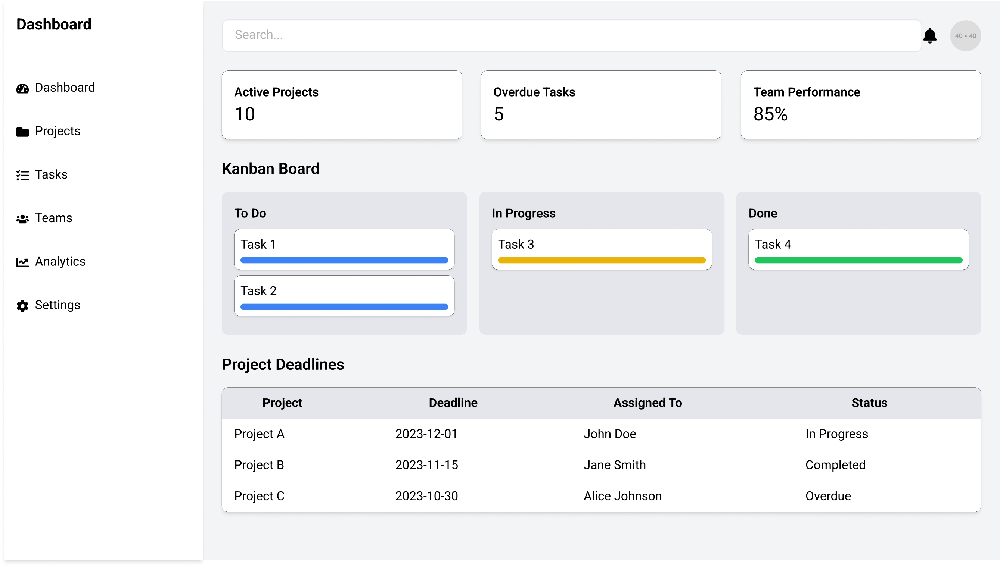
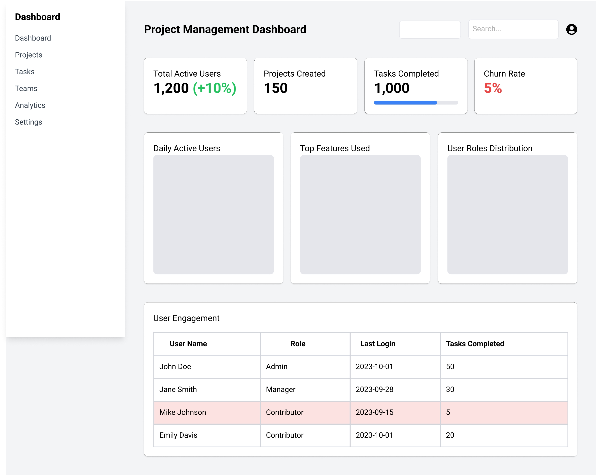

# ProductManagementPortfolio
A portfolio showcasing skills, projects, and tools in product management. Includes case studies, PRDs, roadmaps, user personas, metrics dashboards, and frameworks for the product lifecycle, from ideation to launch. Designed for aspiring and experienced product managers.
Welcome to the Product Management Portfolio! This repository showcases my skills, experience, and tools in Product Management and Business Analysis, particularly in the context of my work as a part-time Product Manager at a Tax and Audit Consultancy Firm. It includes frameworks, templates, and real-world examples that align with the product lifecycle, from ideation to retirement.

About Me
I am a Business Reporting Analyst and a part-time Product Manager with experience in developing, enhancing, and managing tools and processes for clients in various industries, including finance, tax, and audit. My work focuses on driving strategic initiatives, building effective workflows, and delivering solutions that add measurable value to the business.

Contents of the Repository
This repository contains a variety of resources designed to aid aspiring and experienced product managers:

Frameworks & Templates:

B2B SaaS Product Lifecycle Framework: A step-by-step guide to managing the lifecycle of SaaS products.
Product-Market Alignment Framework - Value Proposition Template: Tools to align user needs and business goals.
Case Studies:

Occulus Rift Case Study: A detailed analysis of a real-world product development journey.

PRDs and Wireframes:

PRD Productivity and Integration Enhancements: A sample PRD showcasing feature prioritization and user-centric design.
PRD Wireframe: Early visualizations of product concepts.
Metrics & Analytics:

Metrics Dashboard Design: A blueprint for creating data-driven dashboards for product insights.
Net Promoter Score Worksheet: A tool for measuring customer satisfaction and loyalty.
Surveys & Feedback:

User Feedback Survey: Templates for collecting meaningful user insights.
User Motivation Analysis (The 5 Whys Approach): A structured method for identifying root causes of user behavior.
Planning Tools:

Burndown Chart Examples: Tools for sprint and project progress tracking.
Features and Forces: Frameworks for prioritizing features based on market forces.
Key Highlights
End-to-End Product Lifecycle: Frameworks and tools that guide the entire product journey, from ideation to refinement and retirement.
Data-Driven Decision-Making: Templates and dashboards to make informed product decisions based on analytics and feedback.
Industry-Driven Insights: Resources tailored for B2B SaaS platforms, with applications in tax, audit, and consultancy domains.
Collaboration-Focused: Emphasis on tools and processes that enhance cross-functional teamwork.

How to Use This Repository
Clone the repository to your local system:
bash
git clone https://github.com/farhansadeed/ProductManagementPortfolio.git
Explore the files to find templates, frameworks, and examples relevant to your product management and business analysis needs.
Customize the tools to align with your specific business goals or industry requirements.
